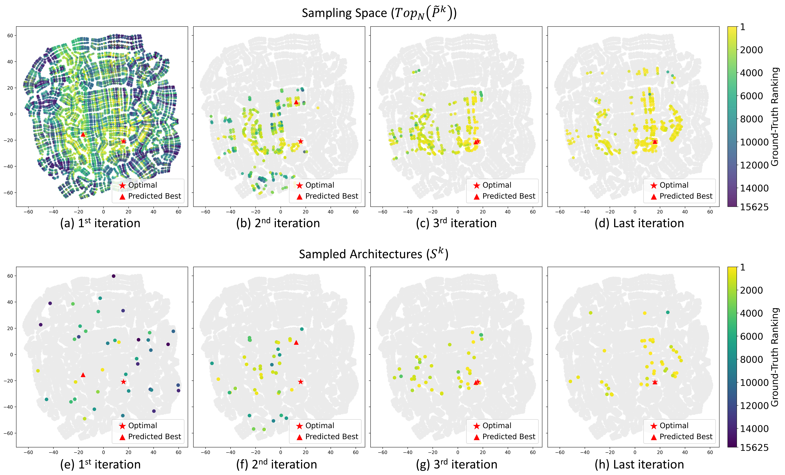

# Stronger NAS with Weaker Predictors
[[NeurIPS'21] Stronger NAS with Weaker Predictors](https://arxiv.org/abs/2102.10490).

Junru Wu, Xiyang Dai, Dongdong Chen, Yinpeng Chen, Mengchen Liu, Ye Yu, Zhangyang Wang, Zicheng Liu, Mei Chen and Lu Yuan

## Overview

Weak Predictors NAS Pipeline
<p align="center">
  
</p>

Search Dynamic Visualization in t-SNE
<p align="center">
  
</p>

## Implementation

- [x] NAS-Bench Search Space
  - [x] NAS-Bench-101 Search Space (CIFAR10)
  - [x] NAS-Bench-201 Search Space (CIFAR10, CIFAR100, ImageNet16-120)
- [ ] Open Domain Search Space
  - [ ] NASNet Search Space (ImageNet)
  - [x] MobileNet Search Space (ImageNet)
- [x] Interpretation
  - [x] Search Dynamic Visualization in t-SNE (NAS-Bench-201)

### Environment
```bash
pip install -r requirements.txt
```

## NASBench Search Space

### NAS-Bench-101

Download pre-processed NAS-Bench-101 from this [Link](https://drive.google.com/file/d/1v0tvvh3yi_S2oDTJMvqFgFimsH1rCz1H/view?usp=sharing), Replace $BENCH_PATH with the file path

Replace --save_dir with your own log path, repeat at least 100 times for stable result

  - ### run WeakNAS
  - ```bash
    python WeakNAS.py --rand_seed -1 --repeat 100 \
    --save_dir OUTPUT/nasbench101/init_100_sample_10/top_start_100_end_100/MLP/onehot_size_1000_1000_1000_1000_iter_100/acq_uniform/deter_False \
    --bench_path $BENCH_PATH --bench nasbench101 --dataset cifar10 --deterministic False \
    --top_start 100 --top_end 100 --init_sample 100 --sample_each_iter 10 --sampling_method uniform \
    --predictor MLP --max_sample 1000 --mlp_size 1000 1000 1000 1000 --mlp_iter 100
    ```
  - ### run WeakNAS + EI Variant
  - ```bash
    python WeakNAS.py --rand_seed -1 --repeat 100 \
    --save_dir OUTPUT/nasbench101/init_100_sample_10/top_start_100_end_100/MLP/onehot_size_1000_1000_1000_1000_iter_100/acq_ei/deter_False \
    --bench_path $BENCH_PATH --bench nasbench101 --dataset cifar10 --deterministic False \
    --top_start 100 --top_end 100 --init_sample 100 --sample_each_iter 10 --sampling_method ei \
    --predictor MLP --max_sample 1000 --mlp_size 1000 1000 1000 1000 --mlp_iter 100 
    ```
    Note: EI calculation took very long time (~10 hrs each run)
  - ###  Plot Figure
  - ```bash
    plot_nasbench101.ipynb
    ```
    
### NAS-Bench-201

- CIFAR10 Subset

  - Download pre-processed NAS-Bench-201 CIFAR10 Subset from this [Link](https://drive.google.com/uc?export=download&id=1-BG879iwZJpgdKlSYM6cgnr5DHerRLs-), Replace $BENCH_PATH with the file path

  - Replace --save_dir with your own log path, repeat at least 100 times for stable result

  - ### run WeakNAS
  - ```bash
    python WeakNAS.py --rand_seed -1 --repeat 100 \
    --save_dir OUTPUT/nasbench201/cifar10/init_10_sample_10/top_start_100_end_100/MLP/onehot_size_1000_1000_1000_1000_iter_100/acq_uniform/deter_False \
    --bench_path $BENCH_PATH --bench nasbench201 --dataset cifar10 --deterministic False \
    --top_start 100 --top_end 100 --init_sample 10 --sample_each_iter 10 --sampling_method uniform \
    --predictor MLP --max_sample 1000 --mlp_size 1000 1000 1000 1000 --mlp_iter 100
    ```
  - ### run WeakNAS + EI Variant
  - ```bash
    python WeakNAS.py --rand_seed -1 --repeat 100 \
    --save_dir OUTPUT/nasbench201/cifar10/init_10_sample_10/top_start_100_end_100/MLP/onehot_size_1000_1000_1000_1000_iter_100/acq_ei/deter_False \
    --bench_path $BENCH_PATH --bench nasbench201 --dataset cifar10 --deterministic False \
    --top_start 100 --top_end 100 --init_sample 10 --sample_each_iter 10 --sampling_method ei \
    --predictor MLP --max_sample 1000 --mlp_size 1000 1000 1000 1000 --mlp_iter 100
    ```
    Note: EI calculation took very long time (~5 hrs each run)
  

- CIFAR100 Subset

  - Download pre-processed NAS-Bench-201 CIFAR100 Subset from this [Link](https://drive.google.com/uc?export=download&id=1RzeGdu_8BEpOKcDgQMY2uaoWTokqrUlc), Replace $BENCH_PATH with the file path

  - Replace --save_dir with your own log path, repeat at least 100 times for stable result
  
  - ### run WeakNAS
  - ```bash
    python WeakNAS.py --rand_seed -1 --repeat 100 \
    --save_dir OUTPUT/nasbench201/cifar100/init_10_sample_10/top_start_100_end_100/MLP/onehot_size_1000_1000_1000_1000_iter_100/acq_uniform/deter_False \
    --bench_path $BENCH_PATH --bench nasbench201 --dataset cifar100 --deterministic False \
    --top_start 100 --top_end 100 --init_sample 10 --sample_each_iter 10 --sampling_method uniform \
    --predictor MLP --max_sample 1000 --mlp_size 1000 1000 1000 1000 --mlp_iter 100
    ```
  - ### run WeakNAS + EI Variant
  - ```bash
    python WeakNAS.py --rand_seed -1 --repeat 100 \
    --save_dir OUTPUT/nasbench201/cifar100/init_10_sample_10/top_start_100_end_100/MLP/onehot_size_1000_1000_1000_1000_iter_100/acq_ei/deter_False \
    --bench_path $BENCH_PATH --bench nasbench201 --dataset cifar100 --deterministic False \
    --top_start 100 --top_end 100 --init_sample 10 --sample_each_iter 10 --sampling_method ei \
    --predictor MLP --max_sample 1000 --mlp_size 1000 1000 1000 1000 --mlp_iter 100
    ```
    Note: EI calculation took very long time (~5 hrs each run)


 - ImageNet16-120 Subset

   - Download pre-processed NAS-Bench-201 ImageNet16-120 Subset from this [Link](https://drive.google.com/uc?export=download&id=1saTFD1-uIPtwuj9MPekw0wnNKS1p3sJE), Replace $BENCH_PATH with the file path

   - Replace --save_dir with your own log path, repeat at least 100 times for stable result

   - ### run WeakNAS
   - ```bash
     python WeakNAS.py --rand_seed -1 --repeat 100 \
     --save_dir OUTPUT/nasbench201/ImageNet16-120/init_10_sample_10/top_start_100_end_100/MLP/onehot_size_1000_1000_1000_1000_iter_100/acq_uniform/deter_False \
     --bench_path $BENCH_PATH --bench nasbench201 --dataset ImageNet16-120 --deterministic False \
     --top_start 100 --top_end 100 --init_sample 10 --sample_each_iter 10 --sampling_method uniform \
     --predictor MLP --max_sample 1000 --mlp_size 1000 1000 1000 1000 --mlp_iter 100
     ```
   - ### run WeakNAS + EI Variant
   - ```bash
     python WeakNAS.py --rand_seed -1 --repeat 100 \
     --save_dir OUTPUT/nasbench201/ImageNet16-120/init_10_sample_10/top_start_100_end_100/MLP/onehot_size_1000_1000_1000_1000_iter_100/acq_ei/deter_False \
     --bench_path $BENCH_PATH --bench nasbench201 --dataset ImageNet16-120 --deterministic False \
     --top_start 100 --top_end 100 --init_sample 10 --sample_each_iter 10 --sampling_method ei \
     --predictor MLP --max_sample 1000 --mlp_size 1000 1000 1000 1000 --mlp_iter 100
     ```
     Note: EI calculation took very long time (~5 hrs each run)
 
  - ###  Plot Figure
  - ```bash
    plot_nasbench201.ipynb
    ```

## Open Domain Search Space
  
### ImageNet (MobileNet Setting)

<p align="center">
  
</p>
Best architecture founded by WeakNAS
<p align="center">
  
</p>

- Train SuperNet
  - We use the codebase [OFA](https://github.com/mit-han-lab/once-for-all) as our training pipeline, directly reuse the weight from pretrain SuperNet variant "ofa_mbv3_d234_e346_k357_w1.2".
- Search
  - More details in imagenet_mobilenet_search.ipynb, it will print out the founded best architecture(s)
- Train from scratch
  - We use the [pytorch-image-models](https://github.com/rwightman/pytorch-image-models) codebase as our training pipeline.
  - Our run of best architecture founded by WeakNAS
    - Best architecture @800 Queries
    ```bash
    cd pytorch-image-models;
    bash distributed_train.sh $NUM_GPU $IMAGENET_PATH --model ofa_mbv3_800 -b 128 \
    --sched cosine --img-size 236 --epochs 300 --warmup-epochs 3 --decay-rate .97 \
    --opt rmsproptf --opt-eps .001 -j 10 --warmup-lr 1e-6 --weight-decay 1e-05 --drop 0.3 \
    --drop-path 0.0 --model-ema --model-ema-decay 0.9999 --aa rand-m9-mstd0.5 \
    --remode pixel --reprob 0.2 --lr 1e-02 --output $LOG_PATH \
    --experiment res_236/bs_128/cosine/lr_5e-03/wd_1e-05/epoch_300/dp_0.0 --log-interval 200
    ```
    - Best architecture @1000 Queries
    ```bash
    cd pytorch-image-models;
    bash distributed_train.sh $NUM_GPU $IMAGENET_PATH --model ofa_mbv3_1000 -b 128 \
    --sched cosine --img-size 236 --epochs 600 --warmup-epochs 3 --decay-rate .97 \
    --opt rmsproptf --opt-eps .001 -j 10 --warmup-lr 1e-6 --weight-decay 1e-05 --drop 0.3 \
    --drop-path 0.0 --model-ema --model-ema-decay 0.9999 --aa rand-m9-mstd0.5 \
    --remode pixel --reprob 0.2 --lr 1e-02 --output $LOG_PATH \
    --experiment res_236/bs_128/cosine/lr_5e-03/wd_1e-05/epoch_600/dp_0.0 --log-interval 200
    ```

  - Adapt to your run of best architecture founded by WeakNAS
    - Modify line 24 - line 53 pytorch-image-models/timm/models/ofa_mbv3.py, add the configuration of architecture founded in search stage as "ofa_mbv3_custom" to default_cfgs
    ```bash
    cd pytorch-image-models;
    bash distributed_train.sh $NUM_GPU $IMAGENET_PATH --model ofa_mbv3_custom -b 128 \
    --sched cosine --img-size 236 --epochs 600 --warmup-epochs 3 --decay-rate .97 \
    --opt rmsproptf --opt-eps .001 -j 10 --warmup-lr 1e-6 --weight-decay 1e-05 --drop 0.3 \
    --drop-path 0.0 --model-ema --model-ema-decay 0.9999 --aa rand-m9-mstd0.5 \
    --remode pixel --reprob 0.2 --lr 1e-02 --output $LOG_PATH \
    --experiment res_236/bs_128/cosine/lr_5e-03/wd_1e-05/epoch_600/dp_0.0 --log-interval 200
    ```
  Previous Tensorboard.dev Logs: [Link](https://tensorboard.dev/experiment/YuDEyzRSQpOQT7ZEZa8tNg/#scalars)

## Open Domain Search Space
  
### Search Dynamic Visualization in t-SNE

- ```bash
  visualize_search_dynamic.ipynb.ipynb
  ```

## Acknowledgement
NASBench Codebase from [AutoDL-Projects](https://github.com/D-X-Y/AutoDL-Projects)  
ImageNet Codebase from [timm](https://github.com/rwightman/pytorch-image-models)

## Citation
if you find this repo is helpful, please cite
```
@article{wu2021weak,
  title={Stronger NAS with Weaker Predictors},
  author={Junru Wu and Xiyang Dai and Dongdong Chen and Yinpeng Chen and Mengchen Liu and Ye Yu and Zhangyang Wang and Zicheng Liu and Mei Chen and Lu Yuan},
  journal={arXiv preprint arXiv:2102.10490},
  year={2021}
}
```
