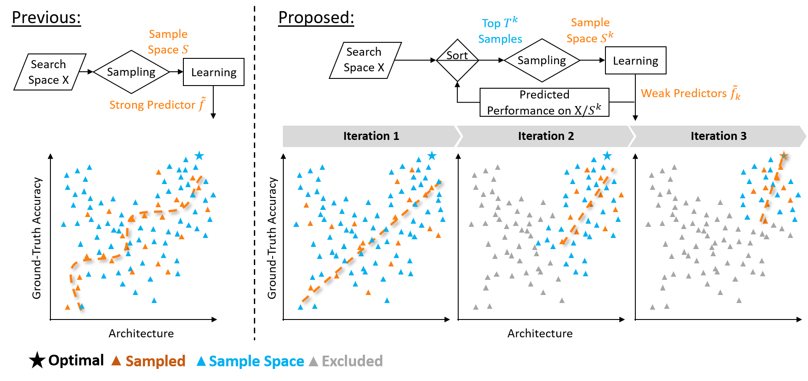
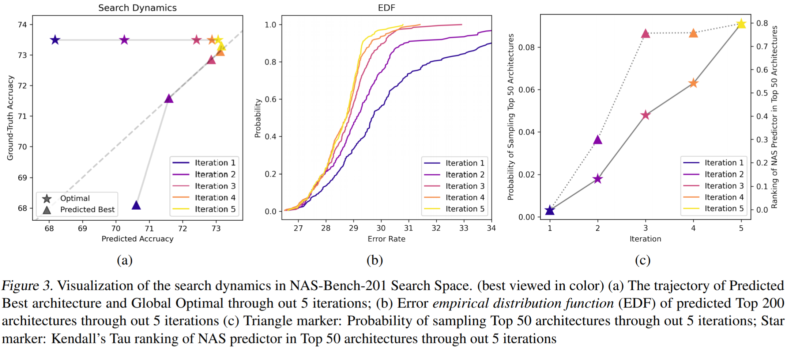
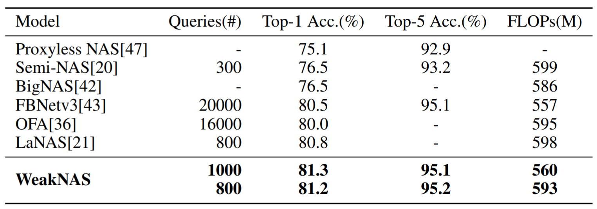
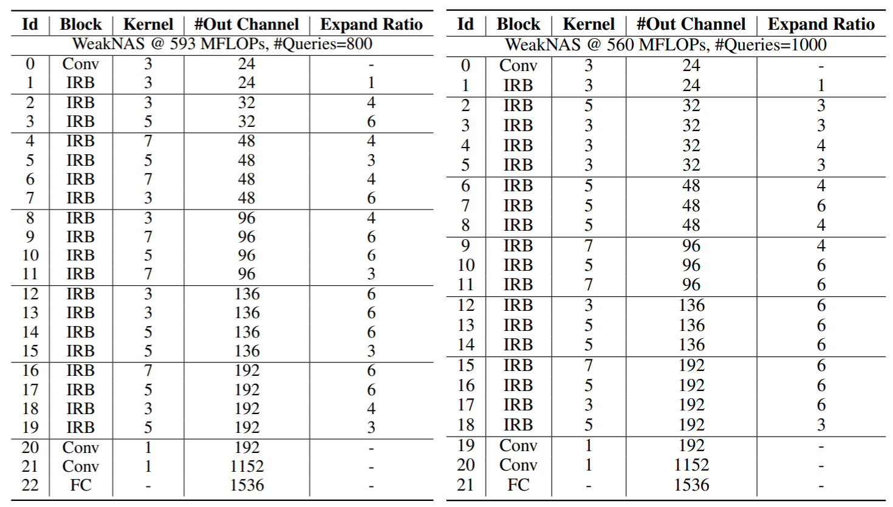

# Stronger NAS with Weaker Predictors
Code used for [Stronger NAS with Weaker Predictors](https://arxiv.org/abs/2102.10490). 

## Main Pipeline





## Results

### Environment
```bash
pip install -r requirements.txt
```

### NASBenchs Search Space

- [NAS-Bench-101](https://github.com/google-research/nasbench)  
Download pre-processed NAS-Bench-101 from this [Link](https://drive.google.com/file/d/1v0tvvh3yi_S2oDTJMvqFgFimsH1rCz1H/view?usp=sharing), Replace $BENCH_PATH with the file path
```bash
python AutoDL-Projects/exps/algos/XGBOOST.py --save_dir $LOG_PATH --rand_seed -1 \
--bench_path $$BENCH_PATH \
--dataset cifar10 --setname valid --feature_list "Arch" \
--bench nasbench101 --scratch_test_epoch 108 --top_decay 0.94 \
--train_set valid --test_set test --rank_top 10 100 0 --top_start 100 \
--top_end 100 --predictor MLP --save_top 5000 --repeat 1 --plot \
--init_sample 100 --sample_each_iter 10 --max_sample 10000 \
--mlp_size 1000 1000 1000 1000 --mlp_iter 200 --sample_decay none
```
- [NAS-Bench-201](https://github.com/D-X-Y/NAS-Bench-201)  
Download pre-processed NAS-Bench-201 from this [Link](), Replace $BENCH_PATH with the file path
```bash
python AutoDL-Projects/exps/algos/XGBOOST.py --save_dir $LOG_PATH --rand_seed -1 \
--bench_path $BENCH_PATH \
--dataset cifar10-valid --setname valid --feature_list "Arch" \
--bench nasbench101 --scratch_test_epoch 108 --top_decay 0.94 \
--train_set x-valid --test_set ori-test --rank_top 10 100 0 --top_start 100 \
--top_end 100 --predictor MLP --save_top 5000 --repeat 1 --plot \
--init_sample 50 --sample_each_iter 10 --max_sample 15625 \
--mlp_size 1000 1000 1000 1000 --mlp_iter 200 --sample_decay none
```

### Open Domain Search Space

- ImageNet (MobileNet Setting)
<p align="center">
  
</p>
Best architecture founded by WeakNAS
<p align="center">
  
</p>

Reproduce Best architecture @800 Queries
```bash
cd pytorch-image-models;
bash distributed_train.sh $NUM_GPU $IMAGENET_PATH --model ofa_mbv3_800 -b 128 \
--sched cosine --img-size 236 --epochs 300 --warmup-epochs 3 --decay-rate .97 \
--opt rmsproptf --opt-eps .001 -j 10 --warmup-lr 1e-6 --weight-decay 1e-05 --drop 0.3 \
--drop-path 0.0 --model-ema --model-ema-decay 0.9999 --aa rand-m9-mstd0.5 \
--remode pixel --reprob 0.2 --lr 1e-02 --output $LOG_PATH \
--experiment res_224/bs_128/cosine/lr_5e-03/wd_1e-05/epoch_300/dp_0.0 --log-interval 200
```
Reproduce Best architecture @1000 Queries
```bash
cd pytorch-image-models;
bash distributed_train.sh $NUM_GPU $IMAGENET_PATH --model ofa_mbv3_1000 -b 128 \
--sched cosine --img-size 236 --epochs 600 --warmup-epochs 3 --decay-rate .97 \
--opt rmsproptf --opt-eps .001 -j 10 --warmup-lr 1e-6 --weight-decay 1e-05 --drop 0.3 \
--drop-path 0.0 --model-ema --model-ema-decay 0.9999 --aa rand-m9-mstd0.5 \
--remode pixel --reprob 0.2 --lr 1e-02 --output $LOG_PATH \
--experiment res_224/bs_128/cosine/lr_5e-03/wd_1e-05/epoch_600/dp_0.0 --log-interval 200
```
previous Tensorboard.dev Logs: [Link](https://tensorboard.dev/experiment/YuDEyzRSQpOQT7ZEZa8tNg/#scalars)

## Acknowledgement
NASBench Codebase from [AutoDL-Projects](https://github.com/D-X-Y/AutoDL-Projects)  
ImageNet Codebase from [timm](https://github.com/rwightman/pytorch-image-models)

## Citation
if you find this repo is helpful, please cite
```
@article{wu2021weak,
  title={Stronger NAS with Weaker Predictors},
  author={Junru Wu and Xiyang Dai and Dongdong Chen and Yinpeng Chen and Mengchen Liu and Ye Yu and Zhangyang Wang and Zicheng Liu and Mei Chen and Lu Yuan},
  journal={arXiv preprint arXiv:2102.10490},
  year={2021}
}
```
